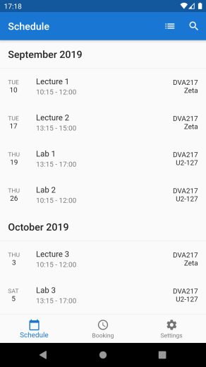
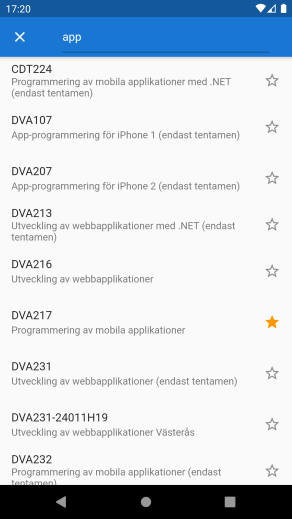
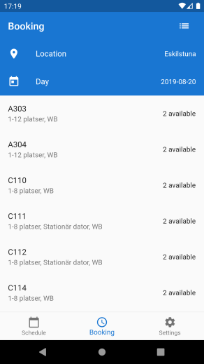
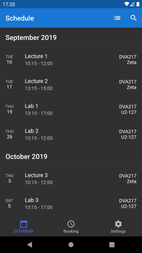

# School Schedule
Unofficial KronoX app for Android and iOS made using Flutter

## State of the Project
The app is finished and available on [Google Play](https://play.google.com/store/apps/details?id=com.crow.school_schedule). It is not available on the App Store as I don't have a license for it, but iOS is still a supported platform if you want to build it yourself.

Some things to keep in mind:
* I don't currently study at any university, so I am not actively using the app anymore, and can therefore not guarantee it will continue to work.
* It's not actively tested by me for all schools available in the app.
* Exam booking is not currently available (#27).

If something stops working, please open up an issue to let me know. You are also very welcome to open a pull request if you want to fix the issue yourself.

## Screenshots
| Schedule | Course Search |
| --- | --- |
|  | 

| Resource Booking | Dark Theme |
| --- | --- |
|  | 